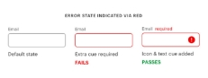
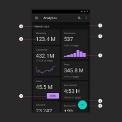
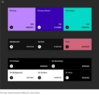
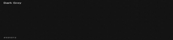
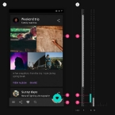
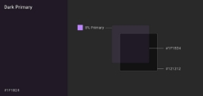
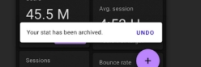
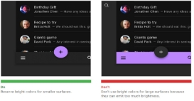
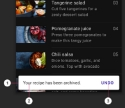
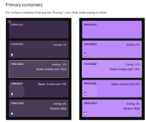

# 
 Dark theme

## Основы

Используйте  **темно-серый,  а  не  черный**,чтобы  выразить  высоту  и  пространство  в  среде  с  более   широким  диапазоном  глубины.

Применяйте  **ограниченные  цветовые  акцентыв**  темных  тематических  интерфейсах,  поэтому   большая  часть  пространства  посвящена  темным  поверхностям.

**Уменьшить** количество  **белых** пикселей 

Поддерживайте  обычных  пользователей  темных  тем  (например,  со  слабым  зрением),  соблюдая   стандарты  **цветового  контраста** специальных  возможностей.

## Свойства

1. **Контрастность:**  темные поверхности  и  100%  белый основной  текст  имеют  уровень  контрастности  не   менее  15,8:1
2. **Глубина:**  на более  высоких  уровняхвысоты  компоненты  выражают  глубину,  отображая  более   светлые  цветаповерхности.
3. **Денасыщенность :**  основные  цвета  денасыщены,  поэтому  они  соответствуют  стандарту  AA,WCAGне   менее  4,5:  1на  всех  уровнях  высот.
4. **Ограниченный  цветовой  набор:** большие  поверхности  используют  темный  цвет  поверхности  с   ограниченными  цветовыми  акцентами  (светлые,  ненасыщенные  и  яркие,  насыщенные  цвета)

### Стандарты  контрастности  WCAG

Текст: 

**4,5:1**

- 18pt  regular,  <14pt  bold 

**3:1**

- >18pt  regular,  >=14pt  bold 
- Компоненты 

Между  текстом  и  бэкграундом- **15.8:1** ААА  -**7:1**  если  приложения  для  стариков

**цвет  не** должен  использоваться  в  качестве  **единственного  визуального  средства** для  передачи   информации,  обозначения  действия  или  различения  элемента

## Анатомия 

1.  Background  (0dp  elevation  ) 2.  Surface  (with  1dp  elevation) 3.  Primary 

4.  Secondary 

5.  On  background 6.  On  Surface 

7.  On  Primary 8.  On  Secondary 

### Основы  цветов  (палитра) ---> 

1.  Базовая  тема  Material  Design  по  умолчанию 2.  Темная  тема  базового  уровня  Material  Design

## Местонахождение

Темную  тему  можно  включить  (или  выключить)  с  помощью  отображаемого  элемента   управления: •  Заметно,  используя  переключатель  значка  для  включения  или  выключения  темы С  уменьшенной  заметностью,  с  переключателем,  размещенным  внутри  меню  или  настроек   приложения

Темы  по  умолчанию  используют  тени  для  выражения  высоты,   в  то  время  **как  темная  тема  также  выражает  высоту,
регулируя  цвет  поверхности.**

  
 

**Наложения  высот  не  применяются  к** поверхностям  компонентов,  использующим  **основные  или  вторичные   цвета.**

В  темной  теме  тени  остаются  темными,  чтобы  точно  представлять  отбрасываемую  тень.

Чтобы  **создать  фирменные  темные  поверхности**,  наложите  основной  цвет  бренда  с  низкой  непрозрачностью  н а  рекомендуемый  цвет  поверхности  темной  темы  (#121212).  Цветовая  #1F1B24  является  результатом  сочетания   темного  цвета поверхности  темы  #121212  и  основного  цвета  8%.

### Caution 
Убедитесь,  что  цвет  фона  достаточно  темный,  чтобы  **основной  текст** соответствовал  уровню  контрастности **не менее  4,5:1  (AA)  на  самой  высокой  возвышенной  поверхности(24dp).**

## Цвета 
Избегайте  использования  насыщенных  цветов,  которые  визуально  вибрируют  на  темном  фоне. **Primary  color**

Базовая  темная  тема  Material  Design  использует  200  тонов  основного  цвета

Пример  основной  палитры  в  темной  теме 1.  Основной  цветовой  индикатор 2.  Тональные  варианты 

Компоненты,  которые  имеют  светлые  поверхности,   могут  отображаться  вариация  основного  цвета  темной  темы. 

### Accent  color

В  темной  теме  темные  поверхности  занимают  большую  часть  пользовательского  интерфейса.  Акцентные

цвета,  как  правило,  светлые  ,  чтобы  помочь  акцентированным  элементам  выделиться.  Их  следует  использовать экономно,  чтобы  **подчеркнуть** ключевые  элементы,  такие  как  текст  или  кнопки.

https://material.io/design/color/the-color-system.html#tools-for-picking-colors

Чтобы  обеспечить  большую  гибкость  и  удобство  использования  в  темной  теме,  **рекомендуется  использовать более  светлые  тона (200-50)**  в  темной  теме,  а  не  цветовую  тему  по  умолчанию  (насыщенные  тона  в  диапазоне   от  900  до  500).

### Brand  colors

Brand  color  -500 Primaraly  color  -200

Brand  Color  можно  исользовать  как  accent  (для  выделения  кнопочек  или  текста)

## Типографика  и  иконография  цветов 

Цвета  "On" По  умолчанию  темными  «включенными»  цветами  темы  являются  белый  и   черный. Когда  светлый  текст  появляется  на  темном  фоне  ,  он  должен  использовать   следующие  уровни  непрозрачности: Текст  с  высоким  акцентом  имеет  непрозрачность 87% Текст  со  средним  акцентом  и  текст  подсказки  имеют  непрозрачность  60% Отключенный  текст  имеет  непрозрачность  38%

## Большие  поверхности

Компоненты,  использующие  большую  часть  экрана,  например   панель  приложения   или  фон,  может  использовать  темную  тему  для  цвета   поверхности  своего  компонента. 

## Сочетание  светлых  и  темных  тем 

Если  в  темной  теме  требуется  светлая  поверхность,  для  сохранения  иерархии   можно  использовать  светлую  окраску  на  выбранных  поверхностях  компонентов. Например,  закусочная  темной  темы  может  отображать  светлую  поверхность,   чтобы  помочь  ей  выделиться.  Для  этого  он  может  применять  цвета  Surface  и  On   Surface светлой  темы. 

## Состояния

Существует  два  типа  контейнеров,  которые  наследуют  наложения  состояния:  контейнеры,  использующие   цвет  «Поверхность»  и  цвет  «Основной».

 

### Отключенные  состояния 

Все  отключенные  компоненты  отображаются  с  использованием  12%  белого  цветадля  контуров  и  заливок   контейнера  

и  38%  белого  цвета  для  содержимого,  такого  как  метки  или  значки.

## Полезные  ссылки

Проверка  цветового  контраста  -

https://products.aspose.app/html/ru/contrast-checker https://www.websiterating.com/ru/color-contrast-perception-checker/ Получить  цветовую  палитру  для  primary  цвета  -

https://material.io/resources/color/#!/?view.left=1&view.right=1&primary.color=8E24AA https://material.io/design/color/the-color-system.html#tools-for-picking-colors Генератор  красивых  цветовых  палитр

https://mycolor.space/?hex=%23BB86FC&sub=1 Random  Material  Generator  выбрать  для  вас  цвета  Material  Design  случайным  образом.   http://codecrafted.net/randommaterial/

