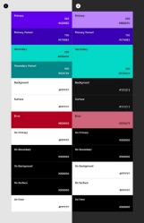
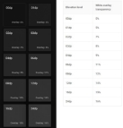

# 
 Dark theme

## Basics

Use **dark gray rather than black** to express height and space in an environment with a wider depth range.

Use **limited color accents in** dark themed interfaces, so most of the space is devoted to dark surfaces.

**Reduce** the number of **white** pixels

Support regular users of dark themes (for example, those with poor eyesight), observing the standards of **color contrast** accessibility.

## Properties

1. **Contrast:** Dark surfaces and 100% white main text have a contrast level of at least 15.8:1
2. **Depth:** At higher levels of height, the components express depth by displaying lighter colored surfaces.
3. **Desaturation :** The primary colors are desaturated, so they comply with the AA,WCAG standard of at least 4.5:1 at all height levels.
4. **Limited color set:** large surfaces use a dark surface color with limited color accents (light, unsaturated and bright, saturated colors)

### WCAG Contrast Standards

Text:

**4,5:1**

- 18 points in regular font, <14 points in bold

**3:1**

- >18pt normal, >=14pt bold
- Components

Between text and background- **15.8:1** AAA -**7:1** if apps are for old people

**color should not** be used as **the only visual means** to convey information, indicate an action or distinguish an element

## Anatomy

1. Background (height 0dp) 2. Surface (with height 1dp) 3. Main

4. Secondary

5. In the background 6. On the surface

7. On The Initial 8. On The Secondary

### Basics of colors (palette) --->

1. Default Base Material Design theme 2. Dark Base Level Material Design theme

## Location

The dark theme can be turned on (or off) using the displayed control: • Noticeably, using the icon switch to turn on or off the theme With reduced visibility, with the switch placed inside the menu or application settings

The default themes use shadows to express height, while **the dark theme also expresses height
by adjusting the color of the surface.**

 

**Height overlays are not applied to ** component surfaces using **primary or secondary colors.**

In a dark theme, the shadows remain dark to accurately represent the shadow being cast.

To **create branded dark surfaces**, apply the main color of the brand with low opacity, and the recommended surface color of the dark theme (#121212). The color #1F1B24 is the result of a combination of the dark color of the surface of the theme #121212 and the main color of 8%.

### Caution
Make sure that the background color is dark enough so that **the main text** corresponds to a contrast level ** of at least 4.5:1 (AA) on the highest elevated surface (24dp).**

## Colors
Avoid using saturated colors that vibrate visually against a dark background. **Main color**

Basic Basic dark theme material design uses 200 tones of color

Example of the main palette in a dark theme 1. The main color indicator 2. Tonal options

Components that have light surfaces may display a variation of the main color of the dark theme.

### Accent color

In a dark theme, dark surfaces take up most of the user interface. Accent

the colors are usually light to help accentuated elements stand out. They should be used sparingly to **emphasize** key elements such as text or buttons.

https://material.io/design/color/the-color-system.html#tools-for-picking-colors

To provide more flexibility and usability in a dark theme, **it is recommended to use lighter tones (200-50)** in a dark theme, rather than the default color theme (saturated tones in the range from 900 to 500).

### Branded colors

Brand color -500 Main color -200

The corporate color can be used as an accent (to highlight buttons or text)

## Typography and iconography of colors

Colors "On" By default, the dark "on" theme colors are white and black. When light text appears on a dark background, it should use the following opacity levels: High-accent text has an opacity of 87% Medium-accent text and hint text have an opacity of 60% Disabled text has an opacity of 38%

## Large surfaces

Components that use most of the screen, such as the application panel or background, can use a dark theme to color the surface of their component.

## Combination of light and dark themes

If a light surface is required in a dark theme, you can use light coloring on the selected component surfaces to preserve the hierarchy. For example, a dark theme diner might display a light surface to help it stand out. To do this, he can apply the colors of the surface and on the surface of a light theme.

## States

There are two types of containers that inherit state overlays: containers using the "Surface" color and the "Primary" color.

 

### Disabled states

All disabled components are displayed using 12% white color for the contours and fills of the container

and 38% white for content such as labels or icons.

## Useful links

Checking the color contrast -

https://products.aspose.app/html/ru/contrast-checker https://www.websiterating.com/ru/color-contrast-perception-checker / Get a color palette for the primary color -

https://material.io/resources/color/#!/?see.left=1&view.right=1&preschool.color=8E24AA https://material.io/design/color/the-color-system.html#tools-for-picking-colors Generator of beautiful color palettes

https://mycolor.space/?hex=%23BB86FC&sub=1 Random Material generator choose for you the colors of the material design randomly. http://codecrafted.net/randommaterial/
